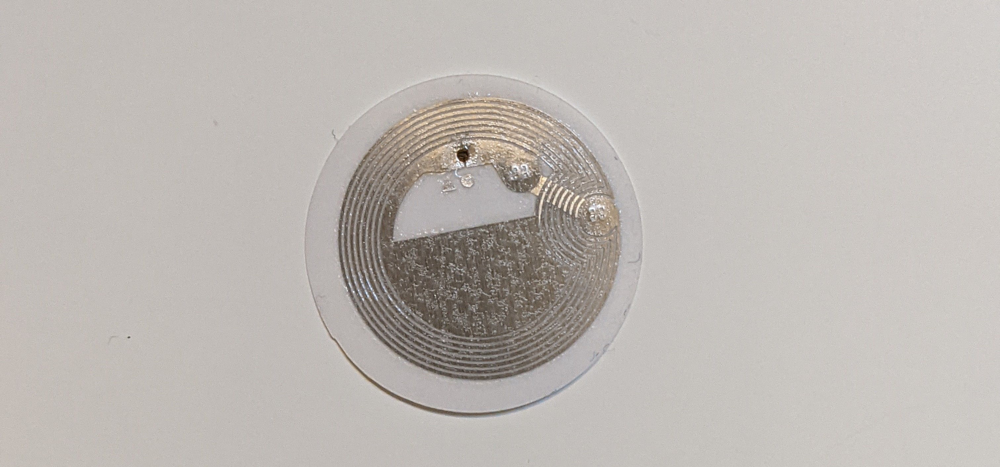

# REACT NFC Sample App
# Enhanced using JSON WEB TOKEN
## About


This is a simple sample app demostrating the usage of the [Web NFC API](https://w3c.github.io/web-nfc/).

This webapp is enhanced with JWT . The normal text will be converted into CipherText with user password

**To get the Web NFC API working you will need an Android Device with Google Chrome and your web app will need to be hosted using https.**

This is the [sample app](https://nfc-acet.pages.dev/) in action.


This project was bootstrapped with [Create React App](https://github.com/facebook/create-react-app).

If you want to see an Angular app using NFCs look at this video [example](https://twitter.com/manekinekko/status/1424697070015991808) and visit [this repo](https://github.com/manekinekko/puzzle-duo-nfc) by the awesome [Wassim](https://twitter.com/manekinekko). Thanks to him I was introduced to the Web NFC API. And Thanks to (https://github.com/kryptocodes) 

### WTF is NFC?

NFC stands for **_Near-Field Communication_**. NFC is a set of communication protocols for communication between two electronic devices.

Electromagnetic fields can be used to transmit data or induce electrical currents in a receiving device. Passive NFC devices draw power from the fields produced by active devices, but the range is short.



You can buy NFC Tags on [Amazon](https://www.amazon.com/gp/product/B0727NYX3B/ref=ppx_yo_dt_b_asin_title_o01_s00?ie=UTF8&psc=1). These tags can contain 540KB of data.

## Usages

NFCs can have multiple usages, some of the usages are:

- Making contactless payments like Google and Apple Pay
- Opening a door using your badge
- Opening a link
- Product control in a warehouse

To learn about the usages visit [this forum](https://nfc-forum.org/what-is-nfc/).

## Getting Started with the Web NFC API

This project uses 4 methods of the Web NFC API

1. Scan: Returns a Promise resolved if starting NFC scan was successful.

   `ndef.scan()`

2. Reading: An event fired when a new reading is available.

   `ndef.onreading()`

3. Reading Error: An event fired when an error happened during reading.

   `ndef.onreadingerror()`

4. Write: Returns a Promise resolved if writing the message (String, ArrayBuffer or NDEF record) with options was successful.
   `ndef.write()`

## Using the Web NFC API methods

## Install JWT - npm install jsonwebtoken

## Using the JWT - import JWT from 'jsonwebtoken';


### Scan, Reading, Reading Error

```javascript
 const scan = useCallback(async() => {

        if ('NDEFReader' in window) { 
            try {
                const ndef = new window.NDEFReader();
                await ndef.scan();
                
                console.log("Scan started successfully.");
                ndef.onreadingerror = () => {
                    console.log("Cannot read data from the NFC tag. Try another one?");
                };
                
                ndef.onreading = event => {
                    console.log("NDEF message read.");
                    onReading(event);
                    setActions({
                        scan: 'scanned',
                        write: null
                    });
                };

            } catch(error){
                console.log(`Error! Scan failed to start: ${error}.`);
            };
        }
    },[setActions]);

    const onReading = ({message, serialNumber}) => {
        setSerialNumber(serialNumber);
        for (const record of message.records) {
            switch (record.recordType) {
                case "text":
                    const textDecoder = new TextDecoder(record.encoding);
                    setMessage(textDecoder.decode(record.data));
                    localStorage.setItem("message",textDecoder.decode(record.data))
                    break;
                case "url":
                    // TODO: Read URL record with record data.
                    break;
                default:
                    // TODO: Handle other records with record data.
                }
        }
    };
```

The **on Decryption** method grabs the message and serial number inside of the NFC tag, the uses the array of reacord inside of the message and decodes the information so its readable to humans.

```javascript
 const Decrypt = async(message) => {
    if(password.length <= 0){
      alert('Please fill all the fields')
         } else {
    
      try{
        const Verify = await JWT.verify(message,password);
        await console.log(Verify)
        await setMessage(Verify)
      } catch(err){
        alert('Wrong Password')
      }
     }
    }
```

### Write

```javascript
 const Write = () => {
    const onWrite = async(message,password) => {
    if(message.length <= 0 || password.length <= 0){
        alert('please fill all the fields');
    }
    else {

        try {
            const hash = await JWT.sign(message,password);
            localStorage.setItem('encrypted',hash);
            const ndef = new window.NDEFReader();
            // const ndef = new window.NDEFReader();
            // // This line will avoid showing the native NFC UI reader
            await ndef.scan();
            await ndef.write({records: [{ recordType: "text", data: hash }]});
            alert(`Value Saved!`);
        } catch (error) {
            console.log(error);
        }
    } 
    }
```

## Learn More & Resources

- https://web.dev/nfc/
- https://www.androidauthority.com/what-is-nfc-270730/
- https://nfc-forum.org/what-is-nfc/
- https://whatwebcando.today/nfc.html
- https://caniuse.com/webnfc
- https://w3c.github.io/web-nfc/

## Available Scripts

In the project directory, you can run:

### `npm start`

Runs the app in the development mode.\
Open [http://localhost:3000](http://localhost:3000) to view it in the browser.

The page will reload if you make edits.\
You will also see any lint errors in the console.

### `npm build`

Builds the app for production to the `build` folder.\
It correctly bundles React in production mode and optimizes the build for the best performance.

The build is minified and the filenames include the hashes.\
Your app is ready to be deployed!

See the section about [deployment](https://facebook.github.io/create-react-app/docs/deployment) for more information.
